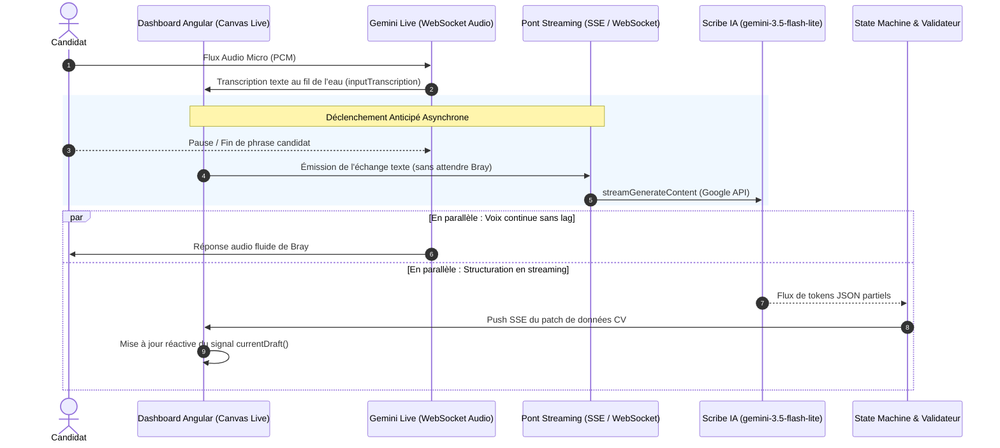

# Architecture Cible : Scribe Asynchrone en Flux Continu (Streaming CV Live)

> **Document de conception technique**  
> **Date :** Septembre 2026  
> **Projet :** FallaJobs — Entretien Vocal IA & CV Builder  
> **Statut :** Spécification & Préparation d'implémentation future  

---

## 1. Contexte & Diagnostic de l'Existant (V2)

### 1.1 Ce qui fonctionne aujourd'hui (Les acquis de la V2)
* **Découplage strict Voix / Structuration :** L'assistant vocal Bray (`gemini-3.1-flash-live-preview`) est 100% dédié à l'échange oral fluide sans exécuter de `tool_calls` perturbateurs.
* **Extraction & State Machine Déterministe :** Le modèle de texte (`gemini-3.5-flash-lite`) extrait les faits selon des clés canoniques strictes et le code backend contrôle la validité des transitions (dates, rôles, complétude).
* **Robustesse :** Zéro hallucination de structure vocale, gestion du barge-in et persistance MySQL propre.

### 1.2 La limite actuelle : Le décalage temporel "Batch"
Aujourd'hui, l'interaction s'opère par tours séquentiels bloquants :
1. Le candidat parle (10 à 20s) ➔ **Le CV reste figé.**
2. L'IA vocale réfléchit et commence à répondre ➔ **Le CV reste figé.**
3. L'IA vocale termine sa phrase (`onModelTurnComplete`) ➔ Un appel HTTP `POST /api/v2/interview/cv/{id}/turn` est envoyé au backend.
4. Le backend appelle `gemini-3.5-flash-lite` en HTTP bloquant synchrone (attente de 1,5 à 2,5s).
5. Le frontend reçoit le JSON complet et actualise le canvas.

```
[Candidat parle] ──────► [Bray répond] ──────► [Requête HTTP POST] ──► [LLM génère JSON] ──► [CV mis à jour]
|<── 15 secondes ───────>|<── 5 secondes ────>|<────────────── 3 à 5 secondes ───────────────>|
                                                                  ▲ Latence perçue : ~5s après la fin du dialogue
```

### 1.3 L'objectif UX visé (L'effet "Temps Réel Magique")
Le candidat parle. Dès qu'il termine sa phrase et pendant que Bray enchaîne naturellement à l'oral, **les blocs du CV (Entreprise, Poste, Période, Compétences) s'animent et apparaissent sous ses yeux en temps réel**.

---

## 2. Architecture Globale : Le Scribe Asynchrone

Pour concilier la fluidité vocale absolue et la réactivité visuelle, l'architecture sépare le flux audio et le flux de structuration en deux pipelines parallèles asynchrones :



---

## 3. Détail des Composants Techniques

### 3.1 Côté Frontend (Angular 18)

#### A. Déclenchement anticipé sur fin de phrase utilisateur
Ne plus attendre l'événement `onModelTurnComplete` de l'IA vocale. Déclencher le traitement dès la fin de parole du candidat dans [gemini-live.service.ts](file:///D:/automatisation/code/dashboard/src/app/core/services/gemini-live.service.ts) :
* Lorsque `commitLine('user')` stabilise une phrase du candidat (silence audio > 600 ms détecté par Gemini Live) :
* Pousser immédiatement le segment texte vers le pont de streaming en arrière-plan.

#### B. Réception par flux d'événements (Server-Sent Events - SSE)
Plutôt que d'attendre la réponse d'un `POST` HTTP classique :
```typescript
// cv-stream.service.ts (Nouveau service à créer)
@Injectable({ providedIn: 'root' })
export class CvStreamService {
  connectCvStream(cvId: string, sessionId: string): Observable<CvPatchEvent> {
    return new Observable(observer => {
      const eventSource = new EventSource(`/api/v2/interview/cv/${cvId}/stream?sessionId=${sessionId}`);
      
      eventSource.addEventListener('cv_patch', (event: MessageEvent) => {
        const patch = JSON.parse(event.data);
        observer.next(patch);
      });

      eventSource.addEventListener('state_change', (event: MessageEvent) => {
        const stateInfo = JSON.parse(event.data);
        observer.next(stateInfo);
      });

      return () => eventSource.close();
    });
  }
}
```

#### C. Animation et fusion non destructive
* Le composant [cv-preview.component.ts](file:///D:/automatisation/code/dashboard/src/app/shared/components/cv-preview/cv-preview.component.ts) applique les patchs via un signal Angular.
* Effet CSS subtil de surbrillance (`animate-pulse` ou halo doré temporaire) sur les nouveaux éléments injectés (ex: une nouvelle puce ou une nouvelle ligne d'expérience) pour faire ressentir l'action de l'IA au candidat.

---

### 3.2 Côté Backend (Spring Boot 3.3.2)

#### A. Endpoint de Streaming Asynchrone (SSE)
Création d'un contrôleur dédié au streaming dans le module `cv/interview/controller` :
```java
@RestController
@RequestMapping("/api/v2/interview/cv/{cvId}")
@RequiredArgsConstructor
public class CvInterviewStreamController {

    private final CvInterviewStreamService streamService;

    @GetMapping(value = "/stream", produces = MediaType.TEXT_EVENT_STREAM_VALUE)
    public SseEmitter subscribeToCvStream(
            @PathVariable Long cvId,
            @RequestParam String sessionId,
            @AuthenticationPrincipal UserDetails userDetails
    ) {
        return streamService.createEmitter(cvId, sessionId);
    }

    @PostMapping("/push-transcript")
    @ResponseStatus(HttpStatus.ACCEPTED)
    public void pushTranscriptSegment(
            @PathVariable Long cvId,
            @RequestBody TranscriptSegmentDto segment
    ) {
        streamService.processSegmentAsync(cvId, segment);
    }
}
```

#### B. Appel à `streamGenerateContent` de Google
Remplacement de l'appel bloquant `generateContent` par l'API streaming de Gemini dans [GeminiLiveTokenService.java](file:///D:/automatisation/code/backend/src/main/java/com/getjob/backend/ai/service/GeminiLiveTokenService.java) :
* Endpoint Google : `/v1beta/models/gemini-3.5-flash-lite:streamGenerateContent?alt=sse&key=...`
* Utilisation de Spring `WebClient` réactif pour consommer le flux SSE de Google.
* Dès qu'un fragment JSON valide est identifié (ex: clé `company`, `position` ou dates extraites), un événement SSE `cv_patch` est immédiatement diffusé vers le navigateur du candidat.

#### C. Préservation de la State Machine & Gate de Complétude
* Les règles strictes mises en place en V2 ([CvInterviewOrchestratorService.java](file:///D:/automatisation/code/backend/src/main/java/com/getjob/backend/cv/interview/service/CvInterviewOrchestratorService.java)) restent **l'autorité absolue** :
  * Le streaming met à jour les données visuelles au fil de l'eau.
  * Mais le passage formel d'une section à la suivante (ex: `EXPERIENCE` ➔ `PROJECTS`) continue d'exiger la validation en code de `isSectionStrictlyComplete()` (dates obligatoires, poste, entreprise, puces).

---

## 4. Gestion des Cas Limites & Robustesse

| Cas Limite | Risque identifié | Solution architecturale |
| :--- | :--- | :--- |
| **Interruption micro (Barge-in)** | Le candidat coupe l'IA pendant qu'un stream de génération est en cours | Annulation via `AbortSignal` du stream en cours ; prise en compte prioritaire de la nouvelle phrase du candidat. |
| **JSON partiel tronqué** | L'IA stream des tokens JSON incomplets au milieu d'un mot | Le backend n'émet vers le frontend qu'après validation d'une clé complète ou via un mini-parseur de JSON partiel (`JsonNode`). |
| **Reconnexion réseau** | Perte du canal SSE en mobilité | L'événement SSE standard supporte l'en-tête `Last-Event-ID` et la reconnexion automatique native sans perte d'état. |
| **Coût & Quota API** | Déclenchement trop fréquent de requêtes sur des petits bruits | Débouncing de 500ms sur la transcription utilisateur : ne déclencher le scribe que sur des phrases complètes (> 4 mots). |

---

## 5. Plan de Déploiement par Phases

```
┌──────────────────────────────────────────────────────────────────────────────┐
│ Phase 1 : Déclenchement Anticipé (Quick Win immédiat)                        │
│ - Avancer l'appel de synchronisation à la fin de parole du candidat          │
│ - Ne plus attendre la fin de réplique vocale de Bray                         │
│ - Gain : -3 à 4 secondes de latence perçue sans aucun changement serveur    │
└──────────────────────────────────────┬───────────────────────────────────────┘
                                       │
                                       ▼
┌──────────────────────────────────────────────────────────────────────────────┐
│ Phase 2 : Canal de Push SSE Backend                                          │
│ - Mise en place de CvInterviewStreamController et SseEmitter                 │
│ - Découplage de la réponse HTTP : le client reçoit les patchs au fil de l'eau│
└──────────────────────────────────────┬───────────────────────────────────────┘
                                       │
                                       ▼
┌──────────────────────────────────────────────────────────────────────────────┐
│ Phase 3 : Streaming LLM (streamGenerateContent)                              │
│ - Passage à streamGenerateContent sur gemini-3.5-flash-lite                  │
│ - Émission progressive des champs et puces du CV en temps réel               │
└──────────────────────────────────────────────────────────────────────────────┘
```

---

## 6. Synthèse

Cette architecture apporte le meilleur des deux mondes :
1. **La pureté de la V2 est préservée :** Aucune régression sur la voix, aucun tool call intrusif dans Gemini Live, et maintien des règles de complétude rigoureuses.
2. **La réactivité est décuplée :** Le passage au scribe asynchrone transforme un formulaire qui se rechargeait en bloc en une véritable expérience vivante où le CV se dactylographie en direct pendant l'échange oral.
