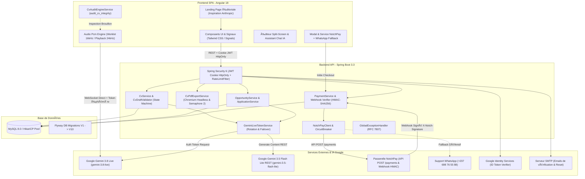
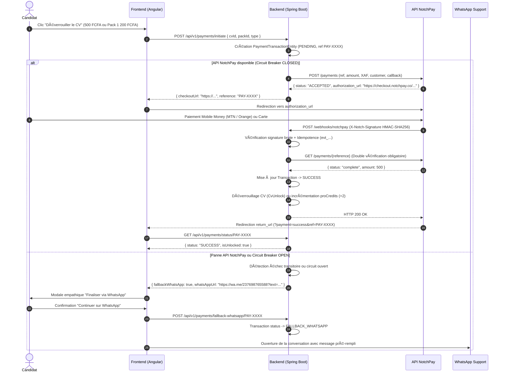
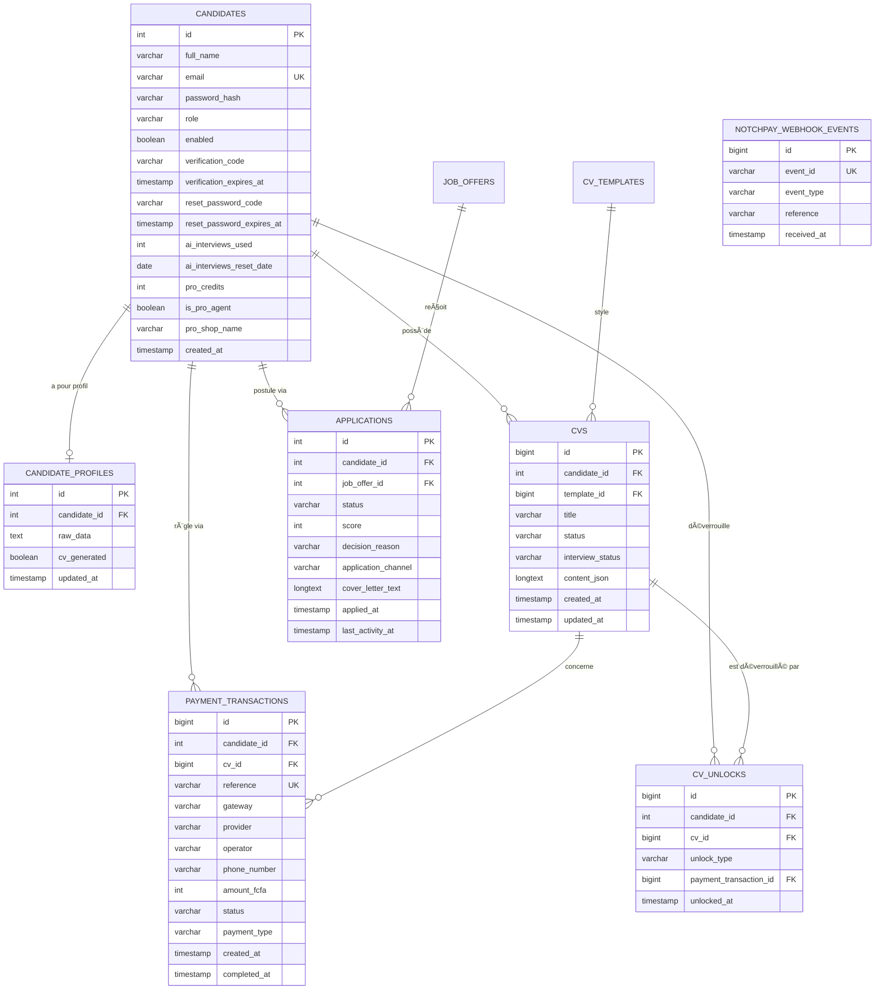

# 🚀 CONTEXTE GLOBAL & RÉFÉRENTIEL TECHNIQUE EXHAUSTIF — FALLAJOBS

> **Date de mise à jour** : 1 octobre 2026  
> **Version active** : 1.4.0  
> **Statut global** : Déployé en production (VPS fallajobs.com) & qualifié  
> **Auteurs & Maintenance** : Équipe d'ingénierie FallaJobs

### État de référence au 1 octobre 2026

- Production déployée sur le commit `62df259`.
- Frontend Angular et backend Spring Boot reconstruits avec Docker ; les deux conteneurs sont `healthy` et `/actuator/health` retourne `UP`.
- Modèle vocal configuré : `gemini-3.8-live`, voix `Charon`, langue `fr-FR`.
- La voix est guidée vers une intonation inspirée du français camerounais contemporain. Gemini Live ne dispose pas d'une voix native `fr-CM` garantie.
- Gemini Live ne reçoit qu'un seul outil : `request_end_interview`. Les mises à jour CV, les audits et la finalisation sont exécutés côté backend.
- Le CV se met à jour après chaque tour vocal finalisé via `POST /interview/v2/turn`. Le canal SSE est disponible, mais le frontend ne pousse pas encore les segments partiels vers `/push-transcript`.
- Les tests backend passent : **33 tests, 0 échec**. Le build Angular production passe avec les budgets `anyComponentStyle` à `8 kB` (warning) et `12 kB` (erreur).

---

## 📑 TABLE DES MATIÈRES
1. [Vision, Mission & Proposition de Valeur](#1-vision-mission--proposition-de-valeur)
2. [Architecture Système Globale & Diagrammes](#2-architecture-système-globale--diagrammes)
3. [Architecture Backend (Spring Boot 3.3 / Java 17-21)](#3-architecture-backend-spring-boot-33--java-17-21)
4. [Architecture Frontend (Angular 18 / Tailwind CSS)](#4-architecture-frontend-angular-18--tailwind-css)
5. [Intelligence Artificielle, Audio Temps Réel & Prompts](#5-intelligence-artificielle-audio-temps-réel--prompts)
6. [Schéma de Données & Persistance (MySQL / Flyway V1 -> V14)](#6-schéma-de-données--persistance-mysql--flyway-v1---v14)
7. [Référentiel Complet des Endpoints REST & Contrats](#7-référentiel-complet-des-endpoints-rest--contrats)
8. [Catalogue des Modèles de CV (Microsoft Word & ATS)](#8-catalogue-des-modèles-de-cv-microsoft-word--ats)
9. [Sécurité, Multi-Tenancy & Conformité OWASP](#9-sécurité-multi-tenancy--conformité-owasp)
10. [Audit de Préparation Production & Décisions Clés](#10-audit-de-préparation-production--décisions-clés)
11. [Variables d'Environnement & Déploiement](#11-variables-denvironnement--déploiement)
12. [Règles d'Or d'Ingénierie & Normes de Qualité](#12-règles-dor-dingénierie--normes-de-qualité)

---

## 🎯 1. Vision, Mission & Proposition de Valeur

### 1.1. Problématique Métier
La recherche d'emploi et la création d'un CV percutant représentent des obstacles majeurs pour des millions de candidats :
- **Barrière de la rédaction** : Difficulté à formuler ses expériences avec des verbes d'action, à quantifier ses réalisations et à structurer un document clair.
- **Fracture numérique et mobile** : Des candidats très qualifiés manquent d'un ordinateur ou d'une maîtrise des outils bureautiques (Word/Canva) pour concevoir un CV moderne et lisible par les robots ATS (*Applicant Tracking Systems*).
- **Processus de candidature fragmenté** : Dispersions entre la recherche d'offres sur de multiples plateformes, l'adaptation du CV et le suivi des statuts de candidature.

### 1.2. La Solution FallaJobs
FallaJobs unifie l'ensemble du cycle de recherche d'emploi en un espace de travail personnel assisté par IA :
1. **Coach Vocal Interactif (Google Gemini 3.8 Live)** : Un entretien audio direct via WebSocket où l'IA pose des questions bienveillantes, analyse les réponses vocales du candidat en temps réel et structure automatiquement son CV sans saisie manuelle.
2. **Détection Proactive d'Anomalies (`audit_cv_integrity`)** : Outil algorithmique déterministe côté client analysant chevauchements de dates, inversions chronologiques, doublons et incomplétudes pendant l'entretien vocal, permettant à l'IA d'interroger le candidat en cas de doute.
3. **Éditeur & Galerie de CV Haute Fidélité (Style Microsoft Word)** : Rendu fidèle A4 multipages physique, personnalisation typographique et chromatique, édition assistée par chat IA, et double moteur d'export PDF 100% gratuit et sans contrainte (Chromium headless côté serveur avec jeton éphémère + jsPDF vectoriel côté client).
4. **Analyseur Multimodal de Documents (OCR)** : Import de CV existants (PDF, PNG, JPG) via Gemini 2.0 Flash avec extraction et restructuration JSON sans perte. Contrôle d'éligibilité réservé aux comptes avec au moins 2 crédits Pro (sans débit lors de l'import).
5. **Moteur d'Opportunités & Scoring d'Affinité Dynamique** : Agrégation d'offres, calcul algorithmique du score de correspondance réel (45% à 95% basé sur les compétences et intitulés), génération automatique de lettres de motivation personnalisées (persistées en base MySQL) et suivi Kanban des candidatures.
6. **Passerelle de Paiement Programmatique Sécurisée (NotchPay) & Fallback WhatsApp** :
   - Sessions créées via l'API programmatique `POST https://api.notchpay.co/payments` (500 FCFA unitaire / 1 200 FCFA pack 3 CVs).
   - Redirection vers l'`authorization_url` hébergé NotchPay pour Mobile Money (Orange Money, MTN MoMo) ou carte bancaire.
   - Validation stricte par webhook signé HMAC-SHA256 (`X-Notch-Signature`) calculé sur corps brut, table d'idempotence `notchpay_webhook_event` (`evt_...`), et double vérification sortante obligatoire `GET /payments/{reference}`.
   - Résilience avec client HTTP dédié, timeouts courts, retry exponentiel et circuit breaker autonome (`NotchPayCircuitBreaker`).
   - Bascule assistée automatique sur WhatsApp (`+237 698 76 55 88`) avec message pré-rempli et statut tracé `FALLBACK_WHATSAPP` en cas de panne de la passerelle.

---

## 🏗️ 2. Architecture Système Globale & Diagrammes

### 2.1. Diagramme de Flux et Composants


```mermaid
graph TD
    subgraph Client [Frontend SPA - Angular 18]
        Landing["Landing Page Éditoriale (Inspiration Anthropic)"]
        UI["Composants UI & Signaux (Tailwind CSS / Signals)"]
        AudioEngine["Audio Pcm Engine (Worklet 16kHz / Playback 24kHz)"]
        AuditEngine["CvAuditEngineService (audit_cv_integrity)"]
        CVEditor["Éditeur Split-Screen & Assistant Chat IA"]
        PaymentMod["Modal & Service NotchPay + WhatsApp Fallback"]
    end

    subgraph Backend [Backend API - Spring Boot 3.3]
        Sec["Spring Security 6 (JWT Cookie HttpOnly + RateLimitFilter)"]
        CVService["CvService & CvDraftValidator (State Machine)"]
        CVPdf["CvPdfExportService (Chromium Headless & Semaphore 2)"]
        OppService["OpportunityService & ApplicationService"]
        PayService["PaymentService & Webhook Verifier (HMAC-SHA256)"]
        NotchResil["NotchPayClient & CircuitBreaker"]
        AIToken["GeminiLiveTokenService (Rotation & Failover)"]
        GlobalEx["GlobalExceptionHandler (RFC 7807)"]
    end

    subgraph Persistance [Base de Données]
        MySQL[(MySQL 8.0 / HikariCP Pool)]
        Migrations[Flyway DB Migrations V1 -> V10]
    end

    subgraph External [Services Externes & IA Google]
        GeminiWS["Google Gemini 3.8 Live (gemini-3.8-live)"]
        GeminiREST["Google Gemini 3.5 Flash Lite REST (gemini-3.5-flash-lite)"]
        NotchPay["Passerelle NotchPay (API POST /payments & Webhook HMAC)"]
        WhatsApp["Support WhatsApp (+237 698 76 55 88)"]
        GoogleOAuth["Google Identity Services (ID Token Verifier)"]
        SMTP["Serveur SMTP (Emails de vérification & Reset)"]
    end

    Landing --> UI
    UI -->|REST + Cookie JWT HttpOnly| Sec
    PaymentMod -->|Initie Checkout| PayService
    AudioEngine -->|WebSocket Direct + Token Éphémère| GeminiWS
    AuditEngine -.->|Inspection Brouillon| AudioEngine
    Sec --> CVService
    Sec --> CVPdf
    Sec --> OppService
    Sec --> PayService
    PayService --> NotchResil
    NotchResil -->|API POST /payments| NotchPay
    NotchResil -.->|Fallback Défensif| WhatsApp
    CVService --> AIToken
    CVService --> MySQL
    OppService --> AIToken
    OppService --> MySQL
    PayService --> MySQL
    NotchPay -->|Webhook Signé X-Notch-Signature| PayService
    AIToken -->|Auth Token Request| GeminiWS
    AIToken -->|Generate Content REST| GeminiREST
    Sec --> GoogleOAuth
    Sec --> SMTP
```

### 2.2. Flux de Données de l'Entretien Vocal IA & Audit d'Intégrité

```mermaid
sequenceDiagram
    autonumber
    actor Candidate as Candidat
    participant Front as Frontend (Angular)
    participant Back as Backend (Spring Boot)
    participant GeminiAPI as Google Gemini Live WS

    Candidate->>Front: Clic "Démarrer l'entretien vocal"
    Front->>Back: POST /api/v1/cvs/{id}/interview/session
    Back->>Back: Quota check (3/jour) + Résolution CV (Anti-IDOR)
    Back->>GeminiAPI: POST /v1beta/auth_tokens (x-goog-api-key serveur)
    GeminiAPI-->>Back: Token éphémère (auth_tokens/xxx, uses=3)
    Back-->>Front: { token: "auth_tokens/xxx", cvId: "42", model: "gemini-3.8-live" }
    
    Front->>GeminiAPI: wss://generativelanguage.googleapis.com/.../BidiGenerateContentConstrained
    GeminiAPI-->>Front: setupComplete
    Front->>GeminiAPI: ClientContent (Audio Micro PCM 16kHz)
    GeminiAPI-->>Front: ServerContent (Audio Voix PCM 24kHz)
    
    GeminiAPI-->>Front: turnComplete après la réponse de Bray
    Front->>Back: POST /api/v2/interview/cv/42/turn
    Back->>Back: InterviewObserverService + CvInterviewOrchestratorService
    Back->>Back: CvDraftValidator.validateDraft()
    Back-->>Front: cvDataSoFar + controlMessage
    Front->>Front: Fusion du patch dans currentDraft()
    Note over GeminiAPI,Candidate: Gemini Live ne modifie pas directement la base ; le backend reste l'autorité des écritures
    
    Candidate->>Front: Clic "Terminer l'entretien"
    Front->>Back: POST /api/v1/cvs/42/interview/complete
    Back->>Back: Garde isDraftMeaningful() -> Status COMPLETED / DRAFT_READY
    Back->>Back: Synchronisation candidate_profile
    Back-->>Front: Redirection vers /cv-builder?id=42
```

### 2.3. Flux de Paiement Programmatique NotchPay & Fallback WhatsApp


```mermaid
sequenceDiagram
    autonumber
    actor Candidate as Candidat
    participant Front as Frontend (Angular)
    participant Back as Backend (Spring Boot)
    participant NotchPay as API NotchPay
    participant WhatsApp as WhatsApp Support

    Candidate->>Front: Clic "Déverrouiller le CV" (500 FCFA ou Pack 1 200 FCFA)
    Front->>Back: POST /api/v1/payments/initiate { cvId, packId, type }
    Back->>Back: Création PaymentTransactionEntity (PENDING, ref PAY-XXXX)
    
    alt API NotchPay disponible (Circuit Breaker CLOSED)
        Back->>NotchPay: POST /payments (ref, amount, XAF, customer, callback)
        NotchPay-->>Back: { status: "ACCEPTED", authorization_url: "https://checkout.notchpay.co/..." }
        Back-->>Front: { checkoutUrl: "https://...", reference: "PAY-XXXX" }
        Front->>NotchPay: Redirection vers authorization_url
        Candidate->>NotchPay: Paiement Mobile Money (MTN / Orange) ou Carte
        
        NotchPay->>Back: POST /webhooks/notchpay (X-Notch-Signature HMAC-SHA256)
        Back->>Back: Vérification signature brute + Idempotence (evt_...)
        Back->>NotchPay: GET /payments/{reference} (Double vérification obligatoire)
        NotchPay-->>Back: { status: "complete", amount: 500 }
        Back->>Back: Mise à jour Transaction -> SUCCESS
        Back->>Back: Déverrouillage CV (CvUnlock) ou incrémentation proCredits (+2)
        Back-->>NotchPay: HTTP 200 OK
        
        NotchPay-->>Front: Redirection return_url (?payment=success&ref=PAY-XXXX)
        Front->>Back: GET /api/v1/payments/status/PAY-XXXX
        Back-->>Front: { status: "SUCCESS", isUnlocked: true }
    else Panne API NotchPay ou Circuit Breaker OPEN
        Back->>Back: Détection échec transitoire ou circuit ouvert
        Back-->>Front: { fallbackWhatsApp: true, whatsAppUrl: "https://wa.me/237698765588?text=..." }
        Front->>Candidate: Modale empathique "Finaliser via WhatsApp"
        Candidate->>Front: Confirmation "Continuer sur WhatsApp"
        Front->>Back: POST /api/v1/payments/fallback-whatsapp/PAY-XXXX
        Back->>Back: Transaction status -> FALLBACK_WHATSAPP
        Front->>WhatsApp: Ouverture de la conversation avec message pré-rempli
    end
```

### 2.4. Flux d'Export PDF Haute Définition (Headless Chromium)

```mermaid
sequenceDiagram
    autonumber
    actor Candidate as Candidat
    participant Front as Frontend (Angular)
    participant Back as Backend (Spring Boot)
    participant Chromium as Moteur Chromium Headless

    Candidate->>Front: Clic "Télécharger en PDF HD" (100% gratuit)
    Front->>Back: POST /api/v1/cvs/42/download-ticket?template=moderne
    Back->>Back: Contrôle Anti-IDOR (Export 100% gratuit, aucun contrôle de paiement)
    Back->>Back: Génération ticket éphémère (TTL 300s)
    Back-->>Front: { downloadUrl: "/api/v1/cvs/42/download?token=xxx", token: "xxx" }
    
    Front->>Back: GET /api/v1/cvs/42/download?token=xxx (Nouvel onglet)
    Back->>Back: Consommation du ticket + acquisition sémaphore (max 2 Chromium)
    Back->>Back: Génération Print Token éphémère (TTL 60s)
    Back->>Chromium: Lancement headless Chromium sur URL /print/cv/42?token=yyy
    Chromium->>Back: GET /api/v1/cvs/42/print-data?token=yyy
    Back-->>Chromium: CvDto (JSON complet sans cookies de session)
    Chromium->>Chromium: Rendu HTML/CSS A4 physique
    Chromium-->>Back: Flux PDF vectoriel 100% net
    Back->>Back: Libération sémaphore
    Back-->>Front: Stream PDF (Content-Disposition: attachment; filename="CV_42.pdf")
```

---

## ☕ 3. Architecture Backend (Spring Boot 3.3 / Java 17-21)

### 3.1. Structure des Packages
```text
backend/src/main/java/com/getjob/backend/
├── BackendApplication.java                      # Point d'entrée Spring Boot
├── ai/
│   └── service/
│       └── GeminiLiveTokenService.java          # Gestionnaire pool de clés, jetons éphémères Gemini 3.1 & Vision
├── application/                                 # Module de suivi des candidatures
│   ├── controller/ApplicationController.java
│   ├── domain/ApplicationEntity.java
│   ├── dto/ApplicationDto.java
│   ├── repository/ApplicationRepository.java
│   └── service/ApplicationService.java
├── auth/                                        # Sécurité, JWT & Authentification
│   ├── controller/AuthController.java
│   ├── dto/ (LoginRequest, RegisterRequest, GoogleAuthRequest, VerifyEmailRequest, etc.)
│   ├── filter/JwtAuthenticationFilter.java      # Validation JWT via cookie HttpOnly
│   ├── filter/RateLimitFilter.java              # Limiteur en mémoire avec purge horaire @Scheduled
│   └── service/ (AuthService, JwtService, CandidateUserDetailsService, AuthEmailService)
├── candidate/                                   # Gestion profils et paramètres candidats
│   ├── controller/CandidateProfileController.java
│   ├── domain/CandidateEntity.java, CandidateProfileEntity.java
│   ├── dto/CandidateProfileDto.java
│   ├── repository/CandidateRepository.java, CandidateProfileRepository.java
│   └── service/CandidateProfileService.java
├── common/
│   └── exception/GlobalExceptionHandler.java     # RFC 7807 ProblemDetail unifié
├── config/                                      # Configurations Spring
│   ├── AsyncConfig.java                         # Pool mailTaskExecutor dédié
│   ├── CorsConfig.java                          # CORS strict avec credentials
│   ├── DataInitializer.java                    # Initialisation des rôles et modèles
│   ├── FlywayConfig.java                        # Migration automatique Flyway
│   ├── RestTemplateConfig.java                  # Pool HTTP client, timeouts (3s connect / 10s read)
│   └── SecurityConfig.java                      # Spring Security 6 stateless
├── cv/                                          # Module CV, Édition, Validation & Export
│   ├── controller/CvController.java
│   ├── domain/CvEntity.java, CvTemplateEntity.java
│   ├── dto/CvDto.java
│   ├── repository/CvRepository.java, CvTemplateRepository.java
│   └── service/
│       ├── CvAiOperationsService.java           # Opérations IA texte/multimodal
│       ├── CvDraftValidator.java                # Règles et plafonds défensifs du brouillon
│       ├── CvPdfExportService.java              # Headless Chromium, sémaphore, tokens éphémères
│       └── CvService.java                       # Orchestration complète du cycle de vie CV
├── joboffer/                                    # Catalogue des offres d'emploi
│   ├── domain/JobOfferEntity.java
│   └── repository/JobOfferRepository.java
├── opportunity/                                 # Matching dynamique & Lettres IA
│   ├── controller/OpportunityController.java
│   ├── domain/ (ApplicationChannel, OpportunityStatus)
│   ├── dto/ (OpportunityDto, ActionResponseDto)
│   └── service/OpportunityService.java          # Algorithme 45-95% & rédaction Gemini 2.0 Flash
├── payment/                                     # Passerelle NotchPay, Résilience & Crédits Pro
│   ├── client/NotchPayClient.java               # Client HTTP NotchPay avec retries et timeouts
│   ├── controller/PaymentController.java        # Endpoints checkout, webhooks, fallback WhatsApp
│   ├── domain/ (PaymentTransactionEntity, CvUnlockEntity, NotchPayWebhookEventEntity)
│   ├── dto/ (InitiatePaymentRequestDto, InitiatePaymentResponseDto, CvUnlockStatusDto, etc.)
│   ├── repository/ (PaymentTransactionRepository, CvUnlockRepository, NotchPayWebhookEventRepository)
│   ├── resilience/NotchPayCircuitBreaker.java   # Circuit breaker autonome (état CLOSED, OPEN, HALF_OPEN)
│   └── service/PaymentService.java              # Vérification HMAC, double vérification GET, crédits pro
└── realtime/
    └── controller/RealtimeVoiceController.java  # Point d'initialisation session vocale
```

### 3.2. Fonctionnalités & Garanties Clés du Backend
- **Éradication IDOR (*Insecure Direct Object References*)** :
  - Tout accès à un CV, une candidature ou une transaction extrait le candidat connecté via `SecurityContextHolder`.
  - Pas d'argument `candidateId` manipulable en query param.
- **Résilience NotchPay & Circuit Breaker** :
  - Timeouts : Connect 3s, Read 5s.
  - Retry exponentiel (2-3 tentatives) exclusivement sur erreurs transitoires (timeouts, HTTP 5xx). Zéro retry sur 4xx.
  - Bascule en `OPEN` après 3 échecs consécutifs, redirigeant instantanément vers le fallback WhatsApp.
- **Sécurité Webhook NotchPay** :
  - Signature `X-Notch-Signature` HMAC-SHA256 validée sur le corps brut (*raw body*).
  - Table Flyway V10 `notchpay_webhook_event` garantissant l'idempotence des `evt_...`.
  - Double vérification API sortante obligatoire : `GET https://api.notchpay.co/payments/{reference}`.
- **Validation Défensive du Brouillon (`CvDraftValidator`)** :
  - Plafonds : 20 expériences max, 50 compétences max, 10 formations max, résumé < 2000 caractères.
  - Nettoyage des formes juridiques (`SARL`, `Inc`, etc.).
- **Scoring Dynamique Réel des Offres (45% à 95%)** :
  - Basé sur la comparaison réelle des compétences et intitulés du profil du candidat avec l'offre.
  - Justification textuelle dynamique dans `decisionReason`.
- **Génération Réelle de Lettres de Motivation (Gemini 2.0 Flash)** :
  - Persistée dans la table `application` (`cover_letter_text LONGTEXT`, Migration Flyway V9).
- **Protection des Quotas & Reprise de Session** :
  - 3 sessions vocales complètes par jour et par candidat.
  - Détection de session active (`isResumingActiveSession`) évitant tout double décompte en cas de reconnexion après coupure réseau.
  - Import OCR accessible aux comptes possédant ≥ 2 crédits Pro (sans débit lors de l'import).

---

## 🅰️ 4. Architecture Frontend (Angular 18 / Tailwind CSS)

### 4.1. Principes d'Ingénierie Frontend
- **100% Standalone Components & Signals** : Utilisation exclusive de l'API moderne Angular 18 (`signal()`, `computed()`, `inject()`).
- **Conformité Mobile-First Stricte** :
  - Respect scrupuleux de [`MOBILE_FIRST_STANDARDS.md`](file:///D:/automatisation/code/MOBILE_FIRST_STANDARDS.md) : aucun débordement horizontal (`overflow-x`), conteneurs avec `min-w-0` et `truncate`/`break-words`.
  - Dual layout obligatoire sur les tableaux : vue cartes fluides sur mobile (`block md:hidden`), tableau complet sur desktop (`hidden md:block`).
  - Topbar épurée, boutons d'actions tactiles confortables (≥ 36px).

### 4.2. Arborescence du Frontend
```text
dashboard/src/app/
├── app.routes.ts                                # Table de routage avec Landing en route racine ('')
├── core/
│   ├── guards/auth.guard.ts                     # Protection des routes authentifiées
│   ├── interceptors/auth.interceptor.ts         # withCredentials: true sur toutes les requêtes
│   ├── models/ (auth, cv, opportunity, application, payment)
│   ├── prompts/cv-interview/                    # Prompts modulaires pour l'entretien vocal
│   │   ├── draft-tool-rules.prompt.ts           # Règles de mise à jour du brouillon
│   │   ├── identity-and-guardrails.prompt.ts    # Identité, bienveillance et limites
│   │   ├── interview-algorithm.prompt.ts        # Algorithme en 5 étapes et déclenchement d'audit
│   │   ├── recruiter-persona.prompt.ts          # Persona Bray (recruteur expert)
│   │   └── index.ts                             # Assemblage du System Prompt
│   ├── services/
│   │   ├── audio-pcm-engine.service.ts          # Worklet micro 16kHz & restitution 24kHz
│   │   ├── auth.service.ts                      # Gestion d'état d'authentification
│   │   ├── candidate-profile-api.service.ts     # Communication profil candidat avec backend
│   │   ├── cv-api.service.ts                    # CRUD des CVs
│   │   ├── cv-audit-engine.service.ts           # Moteur d'audit déterministe audit_cv_integrity
│   │   ├── cv-editor.service.ts                 # État réactif du CV et auto-sauvegarde
│   │   ├── cv-interview-api.service.ts          # Réservation de sessions vocales
│   │   ├── gemini-live-ws-client.service.ts     # Client WebSocket audio Gemini 3.1 Live
│   │   ├── interview-session-cache.service.ts   # Cache local de résilience (10 min) après déconnexion
│   │   ├── opportunity-api.service.ts           # Offres d'emploi & lettres IA
│   │   ├── payment.service.ts                   # Tunnel NotchPay, crédits pro & fallback WhatsApp
│   │   └── pdf-export.service.ts                # Rendu PDF client avec filigrane sécurisé
│   └── utils/ui-mapping.ts                      # Traduction des statuts techniques en français
├── features/
│   ├── landing/                                 # Page d'accueil éditoriale (style Anthropic)
│   │   ├── landing.component.ts                 # Canvas dégradé ambiant organique 60 FPS
│   │   ├── landing.component.html               # 4 étapes, connecteurs SVG "corde molle", métiers
│   │   └── landing.component.css                # Teintes ivoire #FAF9F5, Newsreader serif
│   ├── auth/auth.component.ts                   # Connexion, Inscription, Reset MDP, Google Sign-In
│   ├── dashboard/pages/dashboard-home/          # KPIs dynamiques, opportunités prioritaires
│   ├── opportunities/pages/                     # Liste d'offres et vue détaillée avec lettre IA
│   ├── applications/pages/application-list/     # Suivi candidatures (Kanban & Liste)
│   ├── cvs/pages/
│   │   ├── cv-list/                             # Galerie des CVs, pastilles crédits, bouton import
│   │   ├── cv-interview/                        # Orbe vocal réactif, transcription, score d'audit live
│   │   └── cv-print/                            # Rendu A4 épuré pour Chromium headless
│   ├── cv-builder/pages/cv-builder-main/        # Galerie Word, éditeur split-screen, chat IA
│   ├── profile/pages/profile-main/              # Profil candidat & barre de complétion
│   ├── settings/pages/settings-main/            # Paramètres du compte et compte pro
│   ├── documents/documents.component.ts         # Historique des fichiers générés
│   └── activity/activity.component.ts           # Timeline d'activité chronologique
├── layout/
│   ├── app-shell/                               # Coquille principale responsive
│   ├── sidebar/                                 # Navigation latérale claire avec statut
│   └── topbar/                                  # En-tête épuré avec solde crédits pro et profil
└── shared/components/
    ├── button/, card/, status-badge/, score-badge/, modal/, pagination/, feedback/
    ├── agent-pack-modal/                        # Modale de recharge des crédits pour comptes pro
    ├── payment-modal/                           # Modale de paiement NotchPay & fallback WhatsApp
    ├── cv-preview/                              # Prévisualisation A4 multipages physique
    ├── cv-thumbnail/                            # Vignettes vectorielles des templates
    └── cv-templates/                            # Composants de rendu des templates Word/ATS
```

### 4.3. Design System V2 & Tokens Visuels
- **Palette** :
  - `brand-navy` (950: `#071A2F`, 900: `#0B223D`, 800: `#12345A`, 700: `#194574`, 100: `#DCE4F0`, 50: `#EEF2F8`)
  - `brand-orange` (700: `#C2410C`, 600: `#EA580C`, 500: `#F97316`, 400: `#FB923C`, 100: `#FFEDD5`, 50: `#FFF7ED`)
  - `surface` (page: `#F6F8FB`, card: `#FFFFFF`, soft: `#F0F4F8`, preview: `#E8EDF3`)
  - `text` (primary: `#102033`, secondary: `#5D6B7A`, muted: `#5F6E7D`)
- **Motifs CSS légers** : `.pattern-dot-grid`, `.pattern-orange-glow`, `.pattern-navy-grid`.
- **Règles Typographiques** : Remplacement systématique de tous les textes clairs sur fonds clairs par des ratios de contraste WCAG AA ≥ 4.5:1.

---

## 🤖 5. Intelligence Artificielle, Audio Temps Réel & Prompts

### 5.1. Audio Gemini 3.8 Live (`gemini-3.8-live`)
- **Microphone (Entrant)** : Audio capture `AudioContext` à `16 000 Hz`, encodé en PCM 16-bit linéaire mono via `AudioWorklet`.
- **Synthèse Vocale (Sortant)** : Audio reçu en PCM 16-bit à `24 000 Hz`, décodé et chaîné sans coupure (*gapless playback*).
- **Sas Acoustique Anti-Larsen** : Coupure micro automatique pendant la parole de l'IA (`state === 'AI_SPEAKING'`) avec cooldown de 400 ms.
- **Buffer de Transcription Ligne par Ligne** : Regroupement des fragments audio de transcription dans `lineBuffers` avec découpage sur ponctuation (`.`, `?`, `!`, `\n`) pour un affichage textuel stable et fluide.

### 5.2. Architecture Découplée Chat Vocal V2 (production — octobre 2026)
L'architecture cible élimine la surcharge cognitive de Gemini Live en dissociant 4 responsabilités distinctes :
1. **Gemini Live (Moteur Vocal)** :
   - Centré à 100% sur la voix naturelle, l'écoute, le ton chaleureux et fraternel (persona *Bray*).
   - Ne maintient aucun schéma JSON complexe en direct et n'a plus la responsabilité de clore l'entretien de façon autonome.
   - Unique outil de fonction exposé : `request_end_interview` (appelé uniquement si le candidat demande explicitement à arrêter).
2. **State Machine Déterministe Backend (`InterviewStateMachineService`)** :
   - Ordonnancement strict des 10 étapes : `IDENTITY` ➔ `TARGET` ➔ `EXPERIENCE` ➔ `PROJECTS` ➔ `EDUCATION` ➔ `SKILLS` ➔ `LANGUAGES` ➔ `FINALIZE` ➔ `REVIEW` ➔ `DONE`.
   - Plafonds de tours par section (`max_turns`) et validation d'arrêt : refuse toute conclusion prématurée sur de simples expressions d'enchaînement (« *je n'ai pas de projet* », « *c'est tout pour cette partie* »).
3. **Observateur / Extracteur Asynchrone (`InterviewObserverService`)** :
   - Opère en tâche de fond sur les transcriptions textuelles via le modèle REST configuré (`gemini-3.5-flash-lite`).
   - Déduit les informations factuelles sans perturber la latence audio et injecte des consignes de guidage contextuelles `[INTERVIEW_STATE]`.
4. **Consolidation CV (`CvWriterService`)** :
   - Fusionne les données validées dans `CvData` pour prévisualisation temps réel et sauvegarde en base.

### 5.3. Cycle de Vie, Monétisation & Résilience des Crédits
- **Consultation Libre & État Initial `IDLE`** : L'accès à l'interface d'entretien vocal (`/cvs/interview`) n'effectue aucun appel de réservation ni aucun prélèvement de crédit. L'utilisateur découvre l'environnement et configure son audio sans coût.
- **Débit Atomique sur Action Explicite (`startInterviewFlow()`)** : Le débit d'1 crédit Pro et la création de session backend (`POST /api/v1/cvs/{id}/interview/session`) ne sont déclenchés **que** sur validation délibérée (« Commencer l'entretien ») via `decrementProCreditIfAvailable()`.
- **Reprise Gratuite Sécurisée (< 15 min)** : Toute reconnexion ou rafraîchissement d'un CV en cours (y compris avec identifiant `'new'` ou `'cv_default'`) réactive la session active sans prélever de crédit supplémentaire.
- **Garantie de Remboursement Automatique (`refundAbortedInterviewSession`)** :
   - Si la session vocale est interrompue techniquement (fermeture anormale, erreur micro, abandon avant usage signifiant), le crédit Pro est immédiatement récrédité en base, le quota d'interviews décrémenté, et le statut positionné à `ABORTED`.
- **Bannière d'Épuisement Mobile-First Épurée** : Remplacement de l'alerte surdimensionnée par une carte discrète, aux couleurs de la marque (`brand-navy` / `brand-orange`), sans aucun conflit de contraste, guidant vers l'acquisition de crédits.


---

## 🗄️ 6. Schéma de Données & Persistance (MySQL / Flyway V1 -> V10)


```mermaid
erDiagram
    CANDIDATES ||--o| CANDIDATE_PROFILES : "a pour profil"
    CANDIDATES ||--o{ CVS : "possède"
    CANDIDATES ||--o{ APPLICATIONS : "postule via"
    CANDIDATES ||--o{ PAYMENT_TRANSACTIONS : "règle via"
    CANDIDATES ||--o{ CV_UNLOCKS : "déverrouille"
    JOB_OFFERS ||--o{ APPLICATIONS : "reçoit"
    CV_TEMPLATES ||--o{ CVS : "style"
    CVS ||--o{ PAYMENT_TRANSACTIONS : "concerne"
    CVS ||--o{ CV_UNLOCKS : "est déverrouillé par"

    CANDIDATES {
        int id PK
        varchar full_name
        varchar email UK
        varchar password_hash
        varchar role
        boolean enabled
        varchar verification_code
        timestamp verification_expires_at
        varchar reset_password_code
        timestamp reset_password_expires_at
        int ai_interviews_used
        date ai_interviews_reset_date
        int pro_credits
        boolean is_pro_agent
        varchar pro_shop_name
        timestamp created_at
    }

    CANDIDATE_PROFILES {
        int id PK
        int candidate_id FK
        text raw_data
        boolean cv_generated
        timestamp updated_at
    }

    CVS {
        bigint id PK
        int candidate_id FK
        bigint template_id FK
        varchar title
        varchar status
        varchar interview_status
        longtext content_json
        timestamp created_at
        timestamp updated_at
    }

    PAYMENT_TRANSACTIONS {
        bigint id PK
        int candidate_id FK
        bigint cv_id FK
        varchar reference UK
        varchar gateway
        varchar provider
        varchar operator
        varchar phone_number
        int amount_fcfa
        varchar status
        varchar payment_type
        timestamp created_at
        timestamp completed_at
    }

    CV_UNLOCKS {
        bigint id PK
        int candidate_id FK
        bigint cv_id FK
        varchar unlock_type
        bigint payment_transaction_id FK
        timestamp unlocked_at
    }

    NOTCHPAY_WEBHOOK_EVENTS {
        bigint id PK
        varchar event_id UK
        varchar event_type
        varchar reference
        timestamp received_at
    }

    APPLICATIONS {
        int id PK
        int candidate_id FK
        int job_offer_id FK
        varchar status
        int score
        varchar decision_reason
        varchar application_channel
        longtext cover_letter_text
        timestamp applied_at
        timestamp last_activity_at
    }
```

### 6.1. Référentiel des Migrations Flyway
- **V1 - V7** : Schéma initial, authentification, quotas, vérification email, index de performance.
- **V8** (`V8__create_payment_and_pro_credit_tables.sql`) : Table `payment_transactions`, `cv_unlocks`, colonnes `pro_credits` et `is_pro_agent`.
- **V9** (`V9__add_cover_letter_text_to_application.sql`) : Colonne `cover_letter_text LONGTEXT` pour les lettres de motivation rédigées par Gemini 2.0 Flash.
- **V10** (`V10__notchpay_integration_and_webhook_events.sql`) : Élargissement du statut transaction à `VARCHAR(32)` (`FALLBACK_WHATSAPP`), ajout de `gateway` (`NOTCHPAY`), et création de la table d'idempotence `notchpay_webhook_event`.
- **V11** (`V11__add_city_and_target_role_to_candidate.sql`) : Ajout des colonnes `city` (`VARCHAR(100)`) et `target_role` (`VARCHAR(150)`) sur la table `candidate`.
- **V12** (`V12__grant_initial_free_credit_to_candidates.sql`) : Passage de la valeur par défaut de `candidate.pro_credits` à `1` et attribution rétroactive d'1 crédit de bienvenue aux candidats à solde nul sans achat préalable.
- **V13** (`V13__create_cv_interview_session.sql`) : Création de la table `cv_interview_session` dédiée à l'orchestration V2 (état State Machine, section index, tours, transcriptions partielles/totales JSON, snapshot `cv_data_so_far`).
- **V14** (`V14__restore_aborted_interview_credits.sql`) : Nettoyage des sessions orphelines `IN_PROGRESS` (> 1h) vers `ABORTED` et restitution d'1 crédit de régularisation pour les sessions interrompues.

---

## 📡 7. Référentiel Complet des Endpoints REST & Contrats

### 7.1. Authentification & Compte (`/api/v1/auth`)
| Méthode | Route | Sécurité | Description & Payload |
| :--- | :--- | :--- | :--- |
| `POST` | `/api/v1/auth/register` | Public | Inscription : `{ fullName, email, password }` → envoi email code 6 chiffres |
| `POST` | `/api/v1/auth/verify-email` | Public | Validation email : `{ email, code }` → pose cookie JWT `jwt_token` |
| `POST` | `/api/v1/auth/resend-verification` | Public | Renvoi d'un nouveau code : `{ email }` |
| `POST` | `/api/v1/auth/login` | Public | Connexion : `{ email, password }` → pose cookie JWT `jwt_token` |
| `POST` | `/api/v1/auth/google` | Public | Google Sign-In cryptographiquement validé avec fallback `tokeninfo` : `{ credential }` |
| `POST` | `/api/v1/auth/forgot-password` | Public | Demande reset : `{ email }` → code par email |
| `POST` | `/api/v1/auth/reset-password` | Public | Réinitialisation : `{ email, token, newPassword }` |
| `POST` | `/api/v1/auth/logout` | Public | Déconnexion : suppression serveur du cookie `jwt_token` et purge cache local |
| `GET` | `/api/v1/auth/me` | Authentifié | Profil courant : retourne `AuthResponse` connecté (solde crédits synchronisé) |

### 7.2. Profil Candidat (`/api/v1/candidate/profile`)
| Méthode | Route | Sécurité | Description |
| :--- | :--- | :--- | :--- |
| `GET` | `/api/v1/candidate/profile` | Authentifié | Récupère le profil complet du candidat connecté |
| `PUT` | `/api/v1/candidate/profile` | Authentifié | Met à jour le profil (titre, bio, compétences, coordonnées) |

### 7.3. Gestion des CVs, IA & Export PDF (`/api/v1/cvs`)
| Méthode | Route | Sécurité | Description |
| :--- | :--- | :--- | :--- |
| `GET` | `/api/v1/cvs` | Authentifié | Liste paginée des CVs du candidat (`?page=0&size=10`) |
| `GET` | `/api/v1/cvs/{id}` | Authentifié | Détail d'un CV spécifique (Anti-IDOR) |
| `POST` | `/api/v1/cvs` | Authentifié | Création d'un CV : `{ title, template, contentJson? }` |
| `DELETE` | `/api/v1/cvs/{id}` | Authentifié | Suppression d'un CV appartenant au candidat |
| `GET` | `/api/v1/cv-templates` | Public | Liste des modèles de CV actifs disponibles |
| `POST` | `/api/v1/cvs/{id}/interview/session` | Authentifié | Démarre la session vocale Gemini 3.1 Live & réserve le token éphémère (débit atomique 1 crédit) |
| `POST` | `/api/v1/cvs/{id}/interview/refund` | Authentifié | Restitution immédiate d'1 crédit Pro en cas d'interruption technique ou fermeture anormale |
| `POST` | `/api/v1/cvs/{id}/interview/v2/session` | Authentifié | Initialise ou reprend une session d'orchestration vocale V2 persistante |
| `POST` | `/api/v1/cvs/{id}/interview/v2/turn` | Authentifié | Synchronise un tour de parole utilisateur/IA et injecte le bloc de guidage `[INTERVIEW_STATE]` |
| `POST` | `/api/v1/cvs/{id}/interview/v2/request-end` | Authentifié | Validation stricte et déterministe de la demande d'arrêt utilisateur anticipée |
| `PUT` | `/api/v1/cvs/{id}/draft` | Authentifié | Mise à jour du brouillon JSON (validé par `CvDraftValidator`) |
| `POST` | `/api/v1/cvs/{id}/interview/complete` | Authentifié | Finalise l'entretien vocal et synchronise le profil |
| `POST` | `/api/v1/cvs/{id}/synthesize` | Authentifié | Synthèse IA complète à partir d'une transcription textuelle |
| `POST` | `/api/v1/cvs/{id}/ai-edit` | Authentifié | Amélioration ciblée du CV par prompt IA (1 crédit Pro) : `{ prompt, currentData? }` |
| `POST` | `/api/v1/cvs/import` | Authentifié | Import multimodal OCR (contrôle `proCredits >= 2`, 0 débit) |
| `POST` | `/api/v1/cvs/{id}/download-ticket` | Authentifié | Génère un ticket temporaire (TTL 300s) pour téléchargement direct |
| `GET` | `/api/v1/cvs/{id}/download` | Public (Ticket) | Téléchargement PDF Chromium sans cookie via ticket éphémère |
| `GET` | `/api/v1/cvs/{id}/pdf` | Authentifié | Export PDF Chromium direct avec cookie de session |
| `GET` | `/api/v1/cvs/{id}/print-data` | Interne (Token) | Fournit les données CV au Chromium headless via token d'impression (TTL 60s) |

### 7.4. Opportunités & Candidatures (`/api/v1/opportunities`, `/api/v1/applications`)
| Méthode | Route | Sécurité | Description |
| :--- | :--- | :--- | :--- |
| `GET` | `/api/v1/opportunities` | Authentifié | Liste paginée avec matching algorithmique réel (45-95%) |
| `GET` | `/api/v1/opportunities/{id}` | Authentifié | Détail complet d'une offre avec justification du score |
| `POST` | `/api/v1/opportunities/{id}/dismiss` | Authentifié | Ignore et masque l'offre pour le candidat |
| `POST` | `/api/v1/opportunities/{id}/prepare` | Authentifié | Génère la lettre de motivation personnalisée via Gemini 2.0 Flash |
| `GET` | `/api/v1/opportunities/{id}/cover-letter` | Authentifié | Récupère la lettre générée (`{ content }`) |
| `POST` | `/api/v1/opportunities/{id}/apply` | Authentifié | Marque l'opportunité comme postulée (`applied`) |
| `GET` | `/api/v1/applications` | Authentifié | Liste des candidatures (Kanban / Liste) |
| `GET` | `/api/v1/applications/{id}` | Authentifié | Fiche détaillée d'une candidature avec lettre associée |

### 7.5. Passerelle NotchPay, Webhook & Comptes Pro (`/api/v1/payments`)
| Méthode | Route | Sécurité | Description |
| :--- | :--- | :--- | :--- |
| `POST` | `/api/v1/payments/initiate` | Authentifié | Initie un paiement NotchPay avec résilience. Renvoie `{ checkoutUrl, reference }` ou `{ fallbackWhatsApp: true, whatsAppUrl }` |
| `POST` | `/webhooks/notchpay` ou `/api/v1/payments/webhooks/notchpay` | Public (HMAC) | Webhook officiel NotchPay : signature HMAC-SHA256 sur corps brut, idempotence (`evt_...`), double vérification sortante GET |
| `POST` | `/api/v1/payments/fallback-whatsapp/{reference}` | Authentifié | Enregistre le basculement d'une commande vers WhatsApp (`FALLBACK_WHATSAPP`) |
| `GET` | `/api/v1/payments/status/{reference}` | Authentifié | Consultation du statut réel d'une transaction de paiement |
| `GET` | `/api/v1/payments/unlocked-cvs` | Authentifié | Liste des IDs de CVs déverrouillés pour le candidat |
| `GET` | `/api/v1/payments/cvs/{cvId}/status` | Authentifié | Vérifie si un CV spécifique est déverrouillé en HD |
| `POST` | `/api/v1/payments/use-pro-credit` | Authentifié | Déduit 1 crédit pro pour déverrouiller un CV |
| `GET` | `/api/v1/payments/pro-status` | Authentifié | État du compte pro (solde de crédits, total déverrouillés, établissement) |
| `PUT` | `/api/v1/payments/pro-shop` | Authentifié | Met à jour le nom de l'établissement cybercafé / secrétariat |

---

## 🎨 8. Catalogue des Modèles de CV (Microsoft Word & ATS)

| Code Modèle | Nom Commercial | Accent Couleur | Structure & Typographie | Cible Métier |
| :--- | :--- | :--- | :--- | :--- |
| `word-bloc` | **CV Bloc de couleur** | `#243b53` (Ardoise) | En-tête ardoise + 2 colonnes équilibrées | Tech, Chefs de Projet, Design |
| `word-soigne` | **CV Soigné & Énergique** | `#dc2626` (Rouge vif) | Monogramme rond + timeline rouge | Direction, Management, Vente |
| `word-violet` | **CV Créatif Magenta** | `#6b21a8` (Pourpre) | Sidebar violette + avatar & compétences | UI/UX, Médias, Communication |
| `word-cadre` | **CV Cadre & Conseil** | `#d97706` (Doré ambré) | Double encadrement raffiné et filets dorés | Conseil, Audit, Finance |
| `word-navy` | **CV Bleu Nuit Exécutif** | `#1e3a8a` (Bleu marine) | Bandeau sombre supérieur + monogramme | Directeurs, Ingénieurs, PMO |
| `word-minimal` | **CV Minimaliste Filets** | `#1e293b` (Anthracite) | En-tête centré épuré avec double filet | Juridique, RH, Administration |
| `word-peyton` | **CV Typographique Bleu** | `#2563eb` (Bleu roi) | Titres stylisés majuscules + lecture fluide | Marketing, Vente B2B |
| `word-sidebar` | **CV Moderne en colonnes** | `#0284c7` (Bleu ciel) | Colonne latérale grise avec timeline | Développeurs, Systèmes/Réseaux |
| `word-ats` | **CV Classique ATS** | `#000000` (Noir pur) | 100% textuel sans colonnes, optimisé parseurs | Banques, Grandes Administrations |

---

## 🔒 9. Sécurité, Multi-Tenancy & Conformité OWASP

1. **Isolation stricte Multi-Tenancy (Anti-IDOR)** :
   - Tous les modèles de données (CV, Candidature, Paiement, Déverrouillage) sont indexés et filtrés par le `candidate_id` résolu dans le token JWT.
2. **Cookies `HttpOnly` & `SameSite`** :
   - Le jeton JWT est inaccessible depuis le script client (`document.cookie`), éliminant le risque de vol par XSS.
3. **Sécurisation Google Sign-In** :
   - Validation cryptographique stricte par `GoogleIdTokenVerifier` avec contrôle de l'audience `client_id`.
4. **Hachage BCrypt (Facteur 12)** :
   - Stockage sécurisé des mots de passe.
5. **Intégrité Cryptographique des Paiements (NotchPay)** :
   - Validation de signature HMAC-SHA256 sur corps brut.
   - Idempotence absolue par `notchpay_webhook_event`.
   - Double vérification systématique `GET /payments/{reference}` avant tout déverrouillage de ressource.
6. **Export PDF 100% Gratuit & Protection Anti-IDOR** :
   - L'exportation PDF est entièrement gratuite et sans aucune contrainte de facturation ou de déverrouillage préalable.
   - Accès au PDF HD serveur protégé par vérification de propriété du compte (Anti-IDOR) et jetons d'impression éphémères.

---

## 📋 10. Audit de Préparation Production & Décisions Clés

*(Synthèse exhaustive de l'audit de préparation pour le déploiement pilote ~50 utilisateurs)*

### ✅ P0 : Sécurité & Bloquants Critiques — 100% RÉSOLU & VÉRIFIÉ
| Point de Sécurité | Statut | Implémentation |
| :--- | :--- | :--- |
| Validation cryptographique Google Sign-In | **Résolu** | `GoogleIdTokenVerifier` avec contrôle strict d'audience |
| Éradication des fallbacks `candidateId=1` & IDOR | **Résolu** | Résolution systématique via `SecurityContextHolder` / JWT |
| Gestion des erreurs standardisée (RFC 7807) | **Résolu** | `GlobalExceptionHandler` configuré (400, 403, 404, 409, 429) |
| Externalisation des secrets & `.gitignore` | **Résolu** | Fichiers `.env`, `.env.example`, `.gitignore` racine et backend étanches |
| Passerelle NotchPay & Fallback WhatsApp | **Résolu** | API programmatique, webhook HMAC, idempotence, double vérification GET, circuit breaker et repli WhatsApp assisté |
| Export PDF gratuit & protection Anti-IDOR | **Résolu** | Export PDF 100% gratuit sans contrainte, contrôle strict de propriété du CV (Anti-IDOR) |

### ⚠️ P1 : Scalabilité & Fiabilité — 100% RÉSOLU
| Point de Scalabilité | Décision | Implémentation |
| :--- | :--- | :--- |
| Pagination `/opportunities` & `/applications` | **Garder** | Spring Data Pageable + suppression de l'injection massive à la lecture |
| Rate Limiting Auth & IA | **Garder** | `RateLimitFilter` avec purge mémoire horaire `@Scheduled` |
| Scoring dynamique des opportunités | **Garder** | Algorithme d'affinité compétences/intitulés (45% à 95%) |
| Génération réelle de lettres de motivation | **Garder** | Gemini 2.0 Flash + persistance MySQL (Migration Flyway V9) |
| Modèles Gemini officiels | **Garder** | `gemini-3.8-live` (Audio Live) et `gemini-3.5-flash-lite` (observation texte) |
| Pool asynchrone d'envoi d'e-mails | **Garder** | `AsyncConfig` avec pool dédié `mailTaskExecutor` |
| Index MySQL & Migrations de schéma | **Garder** | Migrations Flyway V1 à V10 appliquées |

### 🕓 P2 : Frontend & Rendu Visuel — 100% VALIDÉ
| Composant | Statut |
| :--- | :--- |
| Profils & Paramètres reliés au backend MySQL | **Résolu** via `CandidateProfileApiService` et `CandidateProfileController` |
| Orbe vocal & visualiseur d'ondes | **Résolu** : Animation connectée aux signaux `isAiSpeaking` et `isUserSpeaking` |
| Sas semi-duplex anti-larsen | **Résolu** : Coupure micro pendant la parole IA + cooldown 400ms |
| Transcription temps réel ligne par ligne | **Résolu** : Buffering par ponctuation dans `lineBuffers` |
| Moteur d'audit proactif d'intégrité | **Résolu** : `CvAuditEngineService` (`audit_cv_integrity`) |
| Landing page éditoriale | **Résolu** : Style Anthropic, canvas animé, 4 étapes avec courbes, zéro lien factice |
| Compilation TypeScript & Build Production | **Vérifié** : 0 erreur (`npm run build` et `tsc --noEmit` code retour 0) |

---

## ⚙️ 11. Variables d'Environnement & Déploiement

### 11.1. Variables Requises (`backend/.env`)
```properties
# Port et serveur
SERVER_PORT=8081
FRONTEND_URL=http://localhost:4200

# Base de données MySQL
DB_HOST=localhost
DB_PORT=3308
DB_NAME=emploi
DB_USERNAME=root
DB_PASSWORD=secret_db_password

# Sécurité & JWT (Clé de 256 bits minimum)
JWT_SECRET=votre_cle_secrete_jwt_super_securisee_256_bits_base64
JWT_EXPIRATION_MS=86400000
JWT_COOKIE_SECURE=false # Mettre à true en production HTTPS

# Google OAuth
GOOGLE_CLIENT_ID=votre_google_client_id.apps.googleusercontent.com

# Pool de clés Google Gemini (rotation et failover)
GEMINI_API_KEYS=cle_gemini_1,cle_gemini_2,cle_gemini_3
GEMINI_LIVE_MODEL=gemini-3.8-live
GEMINI_MODEL=gemini-3.5-flash-lite

# Passerelle NotchPay & WhatsApp (Mobile Money & Cartes)
NOTCHPAY_PUBLIC_KEY=pk.live_xxxxxxxxxxxx
NOTCHPAY_PRIVATE_KEY=sk.live_xxxxxxxxxxxx
NOTCHPAY_WEBHOOK_SECRET=votre_secret_webhook_notchpay
NOTCHPAY_BASE_URL=https://api.notchpay.co
PAYMENT_RETURN_URL=http://localhost:4200/cv-builder?payment=success
WHATSAPP_SUPPORT_PHONE=237698765588

# Serveur SMTP (Envoi de codes de validation)
MAIL_HOST=smtp.gmail.com
MAIL_PORT=587
MAIL_USERNAME=votre_email@gmail.com
MAIL_PASSWORD=mot_de_passe_application_gmail
MAIL_FROM=no-reply@getjob.ai

# CORS
CORS_ALLOWED_ORIGINS=http://localhost:4200,https://app.getjob.ai
```

### 11.2. Commandes de Validation
- **Backend** : `mvn clean test-compile` dans `backend/`
- **Frontend** : `ng build --configuration production` dans `dashboard/`
- **TypeScript strict** : `npx tsc --noEmit` dans `dashboard/`

### 11.3. Infrastructure & Déploiement en Production (VPS Docker)
- **Topologie Serveur** :
  - **Hôte** : Serveur VPS de production (`72.62.236.147`) sous Ubuntu/Debian.
  - **Proxy Inverse** : Nginx avec terminaison TLS / SSL Let's Encrypt (`https://fallajobs.com`).
  - **Conteneurs Applicatifs** :
    - `fallajobs-backend` : Image Spring Boot 3.3 / Java 21, exposée sur le port `8081` interne (healthcheck `/actuator/health`).
    - `fallajobs-frontend` : Image Angular 18 Nginx Alpine, exposée sur le port `8082` interne.
  - **Réseau Docker** : `app-network` (bridge externe mutualisé).
- **Fichier des Accès Confidentiels (`DEPLOY_ACCESS.md`)** :
  - Un fichier dédié `DEPLOY_ACCESS.md` situé à la racine du projet contient l'ensemble des accès SSH, chemins de répertoires, mots de passe et procédures pas-à-pas de maintenance.
  - Ce fichier est strictement exclu du contrôle de version via les règles `.gitignore` (`DEPLOY_ACCESS*.md`, `*deploy_access*`). Ne jamais le commiter.

---

## 🏆 12. Règles d'Or d'Ingénierie & Normes de Qualité

1. **Zéro Donnée Factice (*No Mock/Dummy Data*)** : Toutes les informations proviennent d'appels REST réels ou s'affichent via des états vides ergonomiques incitant à l'action.
2. **Priorité Mobile-First Absolue** : Tout écran doit être impeccable sur écrans étroits (360px-430px) sans aucun débordement horizontal.
3. **Robustesse Défensive des Tiers** : Tout appel externe (NotchPay, Gemini) est protégé par timeouts, quotas et repli gracieux (WhatsApp).
4. **Cloisonnement Strict du Code** : Ne jamais modifier le code source de production hors d'une tâche explicite et validée.

